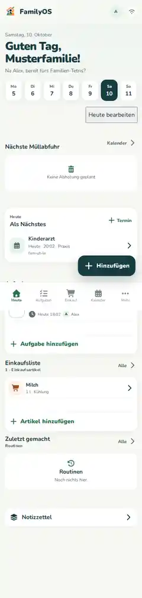

# FamilyOS – Dein Handbuch

FamilyOS soll dir im Familienalltag Arbeit abnehmen. Dieses Handbuch zeigt dir die wichtigsten Funktionen Schritt für Schritt – ohne Techniksprech.

> **Hinweis zu den Bildern:** Die Screenshots stammen aus den automatisierten FamilyOS-Tests. Sie zeigen Testdaten, keine echten Familiendaten. Je nach Rolle, aktivierten Modulen und Bildschirmgröße kann deine Ansicht etwas anders aussehen.

## Neu hier?

Starte mit **[Erste Schritte](getting-started.md)**. Danach findest du dich in den fünf wichtigsten Bereichen schnell zurecht:

## Was möchtest du tun?

| Du möchtest … | Dann lies … |
| --- | --- |
| dich anmelden und orientieren | [Erste Schritte](getting-started.md) |
| Aufgaben anlegen und verteilen | [Aufgaben](tasks.md) |
| einen Einkauf organisieren | [Einkauf](shopping.md) |
| Termine sehen oder anlegen | [Kalender](calendar.md) |
| wiederkehrende Dinge abhaken | [Routinen](routines.md) |
| Familienmitglieder einladen | [Familie & Rechte](family-and-permissions.md) |
| Nachrichten in der Familie nutzen | [Mitteilungen & Benachrichtigungen](inbox-notifications.md) |
| Kalender, Wetter oder andere Quellen verbinden | [Integrationen](integrations.md) |
| Regeln nach dem Muster „Wenn → Dann“ bauen | [Automationen](automations.md) |
| Bonuskarten an der Kasse öffnen | [Bonuskarten](loyalty-cards.md) |
| FamilyOS als App nutzen oder offline verstehen | [PWA & Offline](offline-pwa.md) |
| ein Problem selbst lösen | [Fehlerhilfe](troubleshooting.md) |

## Die wichtigste Idee

Du musst nicht alles einrichten.

Beginne mit den Dingen, die ihr wirklich braucht. Für viele Familien reichen am Anfang:

1. **Heute** – was gerade wichtig ist.
2. **Aufgaben** – wer macht was.
3. **Einkauf** – was fehlt.
4. **Kalender** – was steht an.
5. **Mehr** – alles, was du seltener brauchst.

Weitere Bereiche können je nach Installation und aktivierten Modulen dazukommen.

## Wenn etwas anders aussieht

FamilyOS wird weiterentwickelt. Deshalb kann ein Button einmal leicht anders heißen oder an einer etwas anderen Stelle sitzen. Die Anleitung beschreibt den Stand von `main` zum Zeitpunkt der jeweiligen Doku-Änderung.

Wenn ein kompletter Ablauf nicht mehr stimmt, ist das ein Doku-Fehler. Dann sollte die Dokumentation zusammen mit der App korrigiert werden.

---

**Für Mitwirkende:** Regeln für Stil, Screenshots und Pflege stehen im [Redaktionsleitfaden](editorial-plan.md).
