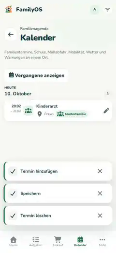

# Kalender

Im Kalender siehst du eigene FamilyOS-Termine und – wenn eingerichtet – Termine aus verbundenen Quellen gemeinsam an einem Ort.

## Zwischen Woche, Monat und Liste wechseln

Öffne **Kalender**. Standardmäßig startet FamilyOS in der **Wochenansicht**.

Oben kannst du jederzeit zwischen drei Ansichten wechseln:

- **Woche** zeigt die sieben Tage der aktuellen Woche. Auf kleineren Displays wählst du oben einen Tag aus und siehst darunter dessen Termine.
- **Monat** gibt dir den Überblick über mehrere Wochen. Tippe auf einen Tag, um dessen Termine darunter zu öffnen.
- **Liste** zeigt die bekannte chronologische Agenda und eignet sich besonders zum Durchsehen vieler Termine.

Mit den Pfeilen wechselst du zum vorherigen oder nächsten Zeitraum. **Heute** bringt dich direkt zur aktuellen Woche beziehungsweise zum aktuellen Monat zurück.

## Von „Heute“ direkt in den richtigen Tag springen

Der **Wochenkompass** auf der Heute-Seite hat links und rechts einen Pfeil zum Wechseln der Woche.

Wenn du eine andere Woche geöffnet hast, bringt dich **Heute** wieder zur aktuellen Woche. Tippst du einen Wochentag an, öffnet FamilyOS den Kalender direkt an diesem Datum.

## Kalenderquellen ein- und ausblenden

Unter der Zeitraum-Navigation findest du die sichtbaren Kalenderquellen. Tippe eine Quelle an, um sie vorübergehend aus- oder wieder einzublenden.

FamilyOS kennzeichnet Quellen nicht nur durch Farbe, sondern zusätzlich durch Namen und Symbol. So bleiben Termine auch dann unterscheidbar, wenn Farben schwer zu erkennen sind.

### Farbe und Symbol einer Quelle ändern

Owner und Erwachsene können unter **Quellen anpassen** für verbundene Kalender eine Farbe und ein unterstütztes Font-Awesome-Symbol auswählen.

Die Einstellung verändert nur die Darstellung in FamilyOS. Zugangsdaten, ICS-Link und Synchronisierungseinstellungen bleiben dabei unverändert.

## Eigenen Termin anlegen

Nutze **Termin**, um einen FamilyOS-Termin anzulegen. Trage Titel, Beginn und bei Bedarf Ende, Ort, Notiz oder Wiederholung ein.

Du kannst einen FamilyOS-Termin optional einer Person aus der Familie zuordnen. Die Zuordnung erscheint anschließend als zusätzliche Personenmarkierung im Kalender.

## Eigenen Termin bearbeiten

Termine, die direkt in FamilyOS angelegt wurden, kannst du wieder öffnen, bearbeiten oder löschen.

## Warum kann ich einen Termin nicht bearbeiten?

Ein Termin kann aus einer externen Quelle stammen – zum Beispiel aus einem ICS-Kalender, Google Calendar, Microsoft Outlook, WebUntis, Moodle oder einem Abfallkalender.

Solche Einträge sind in FamilyOS **nur lesbar**. Änderungen nimmst du in der ursprünglichen Quelle vor. Bei der nächsten erfolgreichen Synchronisierung übernimmt FamilyOS den aktuellen Stand.

## Wiederkehrende und ganztägige ICS-Termine

FamilyOS verarbeitet bei ICS/iCal auch wiederkehrende Termine und deren Ausnahmen. Dazu gehören unter anderem Wiederholungsregeln, ausgelassene Termine, verschobene Einzeltermine und abgesagte Vorkommen.

Ganztägige ICS-Termine bleiben an ihrem Kalendertag verankert und werden nicht durch Zeitzonen auf einen anderen Tag verschoben.

## Vergangene Termine

In der **Listenansicht** kannst du vergangene Termine einblenden. Im Alltag bleiben sie sonst im Hintergrund.

## Externe Kalender verbinden

Kalenderquellen richtest du unter den **Integrationen** ein.

Mehr dazu: **[Integrationen](integrations.md)**.
