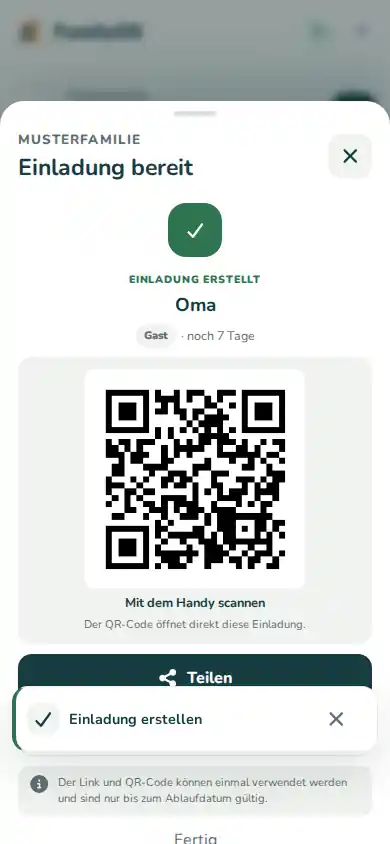

# Familie & Rechte

Unter **Mehr → Familie** verwaltest du die Menschen, die zu eurer FamilyOS-Familie gehören.

## Jemanden einladen

Wenn deine Rolle Einladungen verwalten darf:

1. Öffne **Mehr → Familie**.
2. Wähle **Mitglied einladen**.
3. Wähle die passende Rolle.
4. Ergänze bei Bedarf Name oder E-Mail-Adresse.
5. Erstelle die Einladung.
6. Teile den Link oder den QR-Code.

Eine normale Einladung ist einmal verwendbar und standardmäßig sieben Tage gültig. Wenn du sie an eine bestimmte E-Mail-Adresse bindest, muss sie mit dieser Adresse angenommen werden.

## Welche Rolle passt?

### Owner

Owner verwalten die Familie mit den weitesten Rechten. Diese Rolle solltest du nur Personen geben, die wirklich Verantwortung für die Familienverwaltung übernehmen sollen.

Der letzte Owner ist geschützt: Er kann nicht einfach entfernt oder herabgestuft werden.

### Erwachsene

Erwachsene können viele gemeinsame Bereiche verwalten und normale Familienmitglieder einladen. Owner-Rechte werden über den normalen Familien-Einladungsweg nicht vergeben.

### Teen, Kind und Gast

Diese Rollen sind stärker eingeschränkt. Sie bekommen nur die Funktionen, die für ihre Rolle vorgesehen sind.

Wenn jemand eine Aktion nicht sieht oder nicht ausführen kann, prüfe zuerst die Rolle.

## Rolle ändern oder Mitglied entfernen

Öffne das Mitglied in der Familienverwaltung.

Welche Änderungen du vornehmen kannst, hängt auch von deiner eigenen Rolle ab. Schutzregeln für Owner werden zusätzlich serverseitig geprüft – ein ausgeblendeter Button ist also nicht die einzige Sicherung.

## Owner-Einladung für eine neue Familie

Die erste Owner-Einladung für einen neu angelegten Familienbereich kommt aus der globalen FamilyOS-Verwaltung. Sie ist nicht dasselbe wie die normale Einladung eines weiteren Familienmitglieds.
