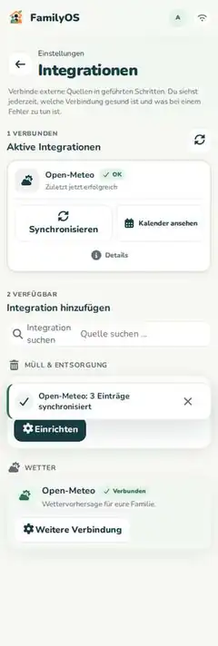

# Integrationen

Integrationen holen Informationen aus anderen Quellen nach FamilyOS.

Du findest sie unter **Mehr → Integrationen**.

## So gehst du vor

1. Öffne den Integrationskatalog.
2. Wähle die Quelle, die du verbinden möchtest.
3. Folge dem geführten Einrichtungsablauf.
4. Speichere die Verbindung.
5. Starte bei Bedarf eine Synchronisierung.

FamilyOS zeigt dir den Status der Quelle. Wenn eine Synchronisierung fehlschlägt, bleiben Fehlerstatus und ein möglicher neuer Versuch sichtbar.

## Typische Quellen

Je nach Installation stehen unter anderem zur Verfügung:

- ICS/iCal-Kalender,
- Google Calendar,
- Microsoft 365,
- WebUntis und Moodle über iCal,
- Abfallkalender für Stadt/Landkreis Kaiserslautern,
- Wetter und Warnungen,
- Home Assistant,
- VRN-Abfahrten,
- Telegram und PWA-Teilen.

Nicht jede Quelle braucht denselben Einrichtungsweg.

## Kalender über ICS

Bei einem privaten Kalender-Link gilt: Behandle ihn wie ein Passwort.

Gib ihn nur in der vorgesehenen Integrationsmaske ein und teile ihn nicht in Mitteilungen oder Screenshots.

## Google oder Microsoft

Wenn OAuth für eure Installation eingerichtet ist, führt dich FamilyOS durch die Verbindung. Der Kalenderzugriff ist für die unterstützten Kalenderintegrationen auf Lesen ausgerichtet.

Termine aus solchen externen Quellen bearbeitest du normalerweise in der Originalanwendung.

## Wenn eine Integration rot oder fehlerhaft ist

1. Öffne die betroffene Quelle.
2. Lies den angezeigten Status.
3. Prüfe Zugang, URL oder Verbindung.
4. Nutze **Erneut versuchen** bzw. synchronisiere erneut, wenn die Aktion angeboten wird.

Wenn der Fehler bleibt, hilft dir **[Fehlerhilfe](troubleshooting.md)** weiter.
