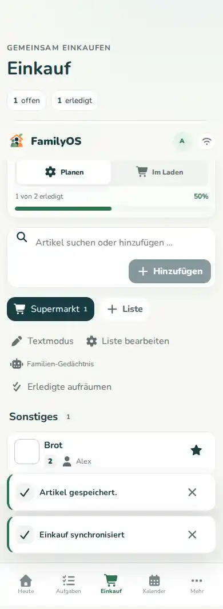

# Einkauf

Im Bereich **Einkauf** planst du eure Listen und hakst Artikel beim Einkaufen ab.

## Artikel schnell hinzufügen

1. Öffne **Einkauf**.
2. Wähle die gewünschte Einkaufsliste.
3. Tippe in das Feld zum Suchen oder Hinzufügen.
4. Gib den Artikel ein.
5. Bestätige.

FamilyOS kann frühere Artikel wieder vorschlagen. Bereits bekannte Angaben können dir dadurch schneller zur Verfügung stehen.

## Mehr Angaben zum Artikel

Wenn es für euch hilfreich ist, kannst du je nach Artikel Angaben wie diese pflegen:

- Menge,
- Kategorie,
- Bereich oder Gang,
- Notiz,
- Favorit.

Für „Milch“ musst du also nicht jedes Mal ein Formular ausfüllen. Details sind optional.

## Beim Einkaufen: Im-Geschäft-Modus

Wenn du im Laden bist, nutze **Im Geschäft**.

Der Modus ist fürs schnelle Abhaken gedacht. So steht die Checkliste im Vordergrund und nicht die Planung.

## Artikel abhaken

Tippe den Artikel an bzw. nutze seine Check-Aktion. Er wird als erledigt gekauft markiert.

Wenn derselbe Artikel später erneut gebraucht wird, kann FamilyOS bekannte Einträge wieder aufgreifen, statt unnötig neue Dubletten anzulegen.

## Mehrere Listen

Du kannst verschiedene Einkaufslisten nutzen, zum Beispiel für:

- Wocheneinkauf,
- Drogerie,
- Baumarkt,
- Party.

Achte vor dem Hinzufügen kurz darauf, welche Liste aktiv ist.

## Offline einkaufen

FamilyOS besitzt für den Einkauf eine Offline-Logik. In der Ansicht siehst du, ob die Offline-Funktion bereit ist.

Wenn dort **Offline nicht bereit** steht, solltest du dich für diesen Einkauf nicht darauf verlassen, dass Änderungen ohne Verbindung sicher zwischengespeichert werden.

Mehr dazu: **[PWA & Offline](offline-pwa.md)**.
