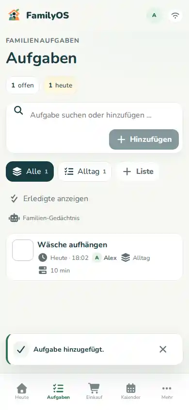

# Aufgaben

Mit Aufgaben hältst du fest, **was** erledigt werden soll und – wenn nötig – **wer** es übernimmt.

## Schnell eine Aufgabe anlegen

1. Öffne **Aufgaben**.
2. Tippe in **Aufgabe suchen oder hinzufügen**.
3. Schreibe kurz, was erledigt werden soll.
4. Bestätige die Eingabe.

Für kleine Dinge reicht das schon.

## Mehr Details ergänzen

Öffne eine Aufgabe, wenn du mehr festlegen möchtest. Je nach Aufgabe kannst du zum Beispiel ergänzen:

- Liste,
- Priorität,
- Fälligkeit,
- zuständige Person,
- geschätzte Dauer,
- Wiederholung.

Du musst nicht jedes Feld ausfüllen. Nutze nur, was euch im Alltag hilft.

## Mit Listen Ordnung schaffen

Wenn viele Aufgaben zusammenkommen, helfen Listen – zum Beispiel:

- Haushalt
- Garten
- Schule
- Wochenende

Du kannst zwischen Listen wechseln und neue Listen anlegen, sofern deine Rolle das erlaubt.

## Aufgabe erledigen

Tippe auf den Haken bzw. die Erledigt-Aktion der Aufgabe.

Erledigte Aufgaben können ausgeblendet oder wieder eingeblendet werden. So bleibt die normale Ansicht ruhig, ohne dass die Historie sofort verschwindet.

## Wenn eine Aufgabe immer wieder kommt

Nutze die Wiederholung der Aufgabe oder prüfe, ob eine **Routine** besser passt.

Eine gute Faustregel:

- **Aufgabe:** „Fenster am Samstag putzen.“
- **Routine:** „Mülltonne nach der Leerung zurückstellen.“

Mehr dazu: **[Routinen](routines.md)**.

## Tipp: Vorschläge nutzen

FamilyOS merkt sich frühere Eingaben und kann passende Vorschläge machen. So musst du häufige Aufgaben nicht jedes Mal vollständig neu tippen.
